#flex布局

flex布局是什么
------

> 任何一个容器都可以指定为flex布局

```css
.box{
    display:flex
}
```

> 行内元素也可以指定为flex布局

```css
.box{
    display: inline-flex;
}
```

> weikit内核的浏览器，应该加上-webkit-

```css
.box{
    display: -webkit-flex;
    display: flex;
}
```

> 设置为flex布局之后，子元素的float clear vertical-align 属性就会失效；

## flex 基本概念


容器默认存在两根轴：水平的主轴**（main axis）** 和垂直的交叉轴 **（cross axis）**。主轴的开始位置（与边框的交叉点）叫做**main start**，结束位置叫做**main end**；交叉轴的开始位置叫做**cross start**，结束位置叫做**cross end**。
项目默认沿主轴排列。单个项目占据的主轴空间叫做**main size**，占据的交叉轴空间叫做**cross size**。

### 容器的属性
+ flex-direction
+ flex-wrap
+ flex
+ -flow
+ justify-content
+ align-items
+ align-content

> flex-direction 舒属性

flex-direction 决定主轴的方向（项目的排列方向）

```css
.box{
    flex-direction: row | row-reverse | column | column-reverse;
}
```

> html 结构

```html
<div class="box">
  <div>1</div>
  <div>2</div>
  <div>3</div>
</div>
```

|css|效果图|
|--|--|
| 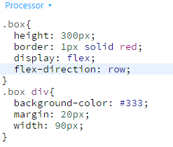| 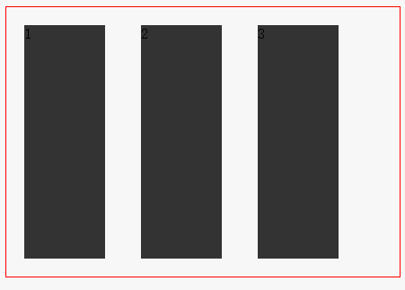|
| 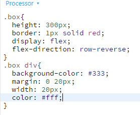| 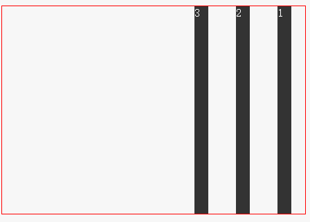|
| 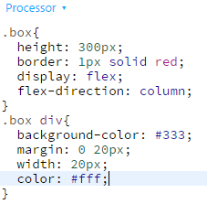| 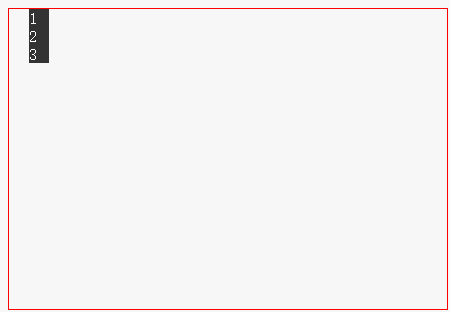|
| 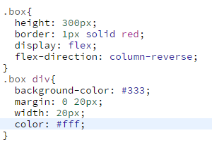| 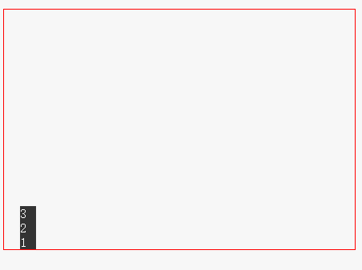|

#### flex-wrap属性
>默认情况下，项目都排在一条线（又称"轴线"）上。flex-wrap属性定义，如果一条轴线排不下，如何换行。


```css
.box{
    flex-wrap:nowrap|wrap|wrap-reverse;
}
```

+ nowrap（默认）：不换行。


+ wrap：换行，第一行在上方。


+ wrap-reverse：换行，第一行在下方


> html结构

```html
<div class="box">
  <div>1</div>
  <div style="width: 30px;">2</div>
  <div style="width:50px;">3</div>
  <div>4</div>
  <div style="width:100px;">5</div>
  <div>6</div>
</div>
```

|css|效果|
|--|--|
| 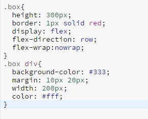| 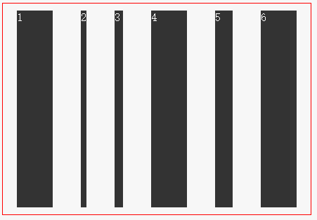|
| 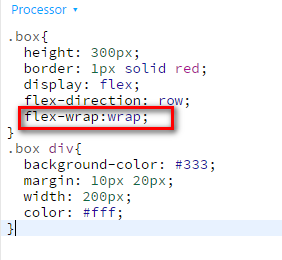| 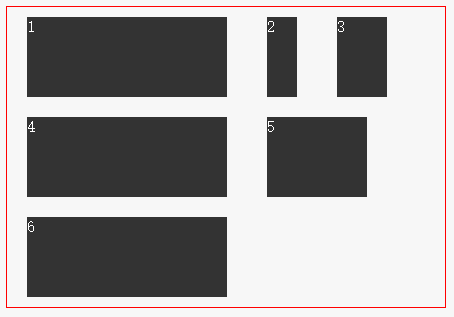|
| 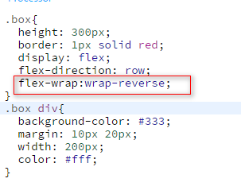| 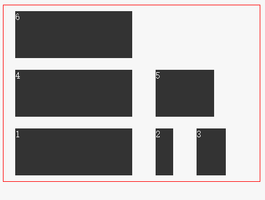|

#### flex-flow
> flex-flow 属性是flex-direction属性和flex-wrap属性的简写形式，默认值为row nowrap。

```css
.box {
  flex-flow: <flex-direction> || <flex-wrap>;
}
```


#### justify-content属性
它可能取5个值，具体对齐方式与轴的方向有关。下面假设主轴为从左到右。

+ flex-start（默认值）：左对齐
+ flex-end：右对齐
+ center： 居中
+ space-between：两端对齐，项目之间的间隔都相等。
+ space-around：每个项目两侧的间隔相等。所以，项目之间的间隔比项目与边框的间隔大一倍。

> justify-content属性定义了项目在主轴上的对齐方式。

```css
.box {
  justify-content: flex-start | flex-end | center | space-between | space-around;
}
```

|css|效果图|
|--|--|
| 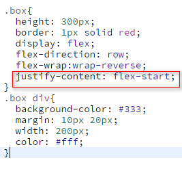| 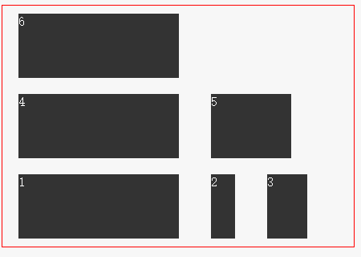|
| | 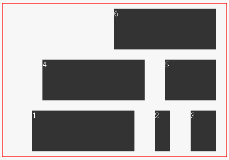|
| 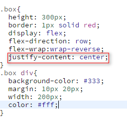| 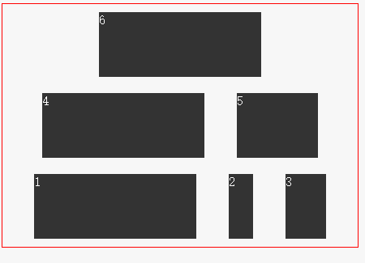|
| 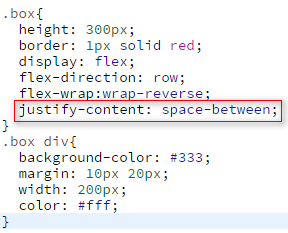| 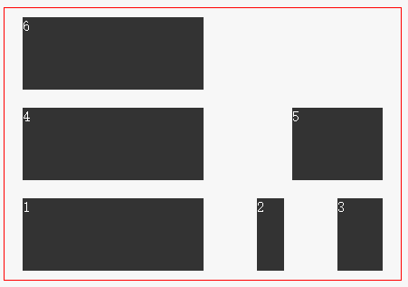|
| 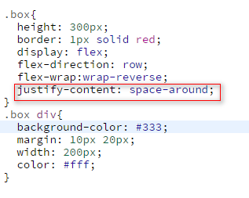| 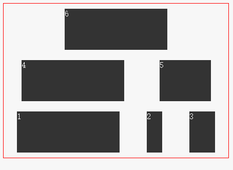|

#### align-items属性

> align-items属性定义项目在交叉轴上如何对齐。

```css
.box {
  align-items: flex-start | flex-end | center | baseline | stretch;
}
```


|效果图|
|--|
| 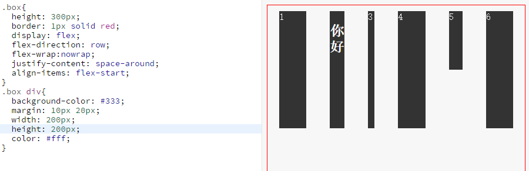|
| 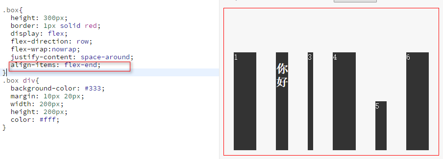|
| 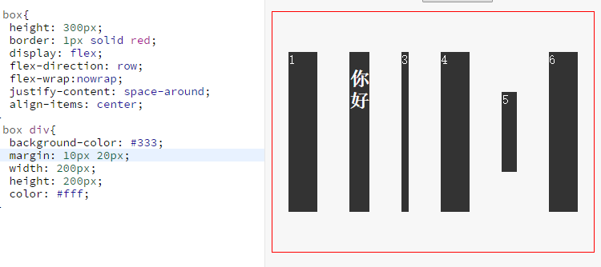|
| 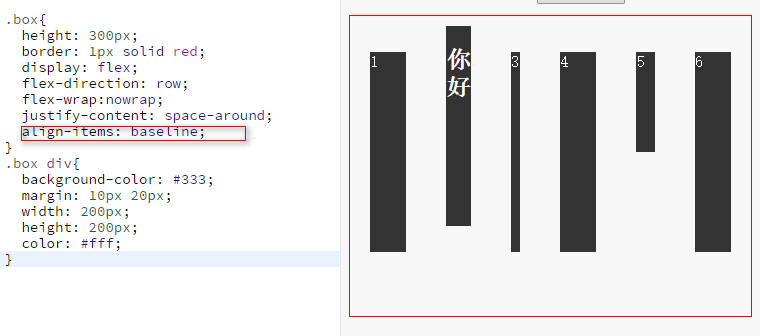|
| 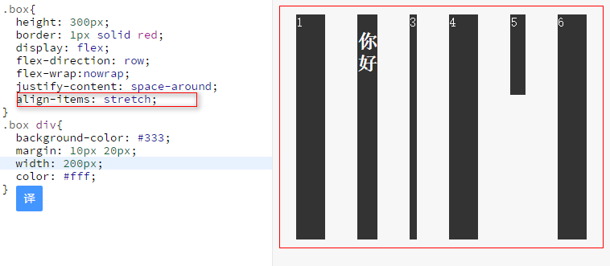|

