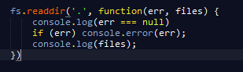
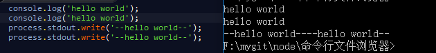

#fs 模块
> var fs = require('fs');

|api|用法|return|特点|
|--|--|--|--|
|fs.readdirSync()|fs.readdirSync(__dirname)|返回当前目录的文件列表|同步版本|
|fs.readdir()|fs.readdir('.',async)  |返回当前目录的文件列表|异步版本|

## process全局对象

> console.log() 与 process.stdout.wirte() 的区别

+ console.log()          **会**在打印的字符串最后加上换行\n 
+ process.stdout.wirte() **不会**在打印的字符串最后加上换行\n 

> process 包含三个流对象

- process.stdin   标准输入
- process.stdout   标准输出
- process.stderr   标准错误

> process 方法

process.cwd() 返回当前工作目录

## fs模块的stream
## fs模块的watch

# 打开windows 的TCP客户端

1. 控制面板
2. 程序
3. 打开或者关闭服务
4. 打开telnet客户端

