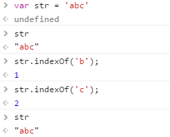
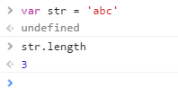
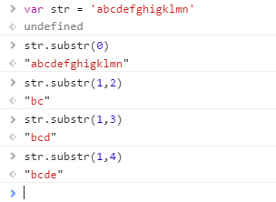
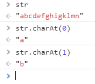
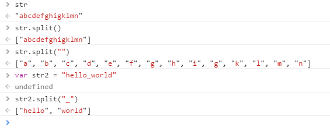

字符串整理
------

|函数名|返回值|是否改变原字符串|
|--|--|--|
|indexOf(str)|从前往后查找字符串位置,大小写敏感，从0开始计数||
|str.length|返回字符串的长度||
|str.substr()|用于字符串截取，一个必选参数，一个可选参数，从0开始计数 ||
|charAt(1)|用于返回指定位置的字符，从0开始计数 ||
|split("")|，用于把一个字符串分割成字符串数组  ||