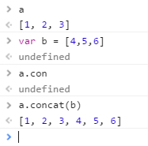
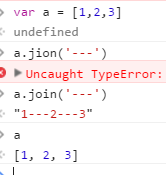
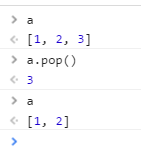
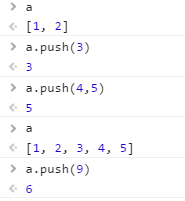
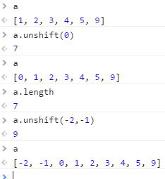
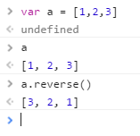
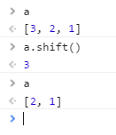
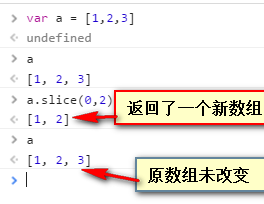
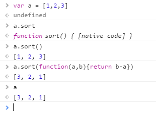
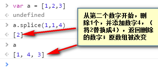

| 函数名 | 作用 | 返回值 |是否改变原数组|
|--|--|--|--|
|concat()|连接数组||
|join()|连接数组||
|join()|删除数组的最后一个元素，并返回数组的最后一个元素||
|push() |向数组的末尾添加一个或更多元素，并返回新的长度||
|unshift()|向数组的开头添加一个或更多元素，并返回新的长度||
|reverse()| 颠倒数组中元素的顺序||
|shift()| 删除并返回数组的第一个元素||
|slice()| 从某个已有的数组返回选定的元素||
|sort()| 对数组的元素进行排序，改变原数组||改变原数组|
|splice()| 删除元素，并向数组添加新元素||改变原数组|

